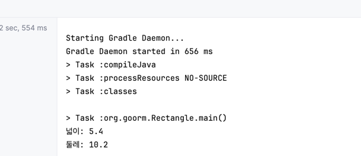
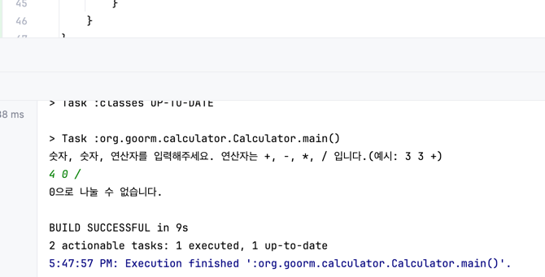
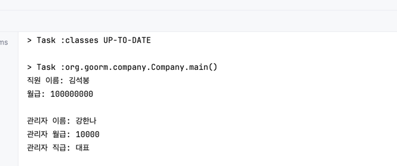
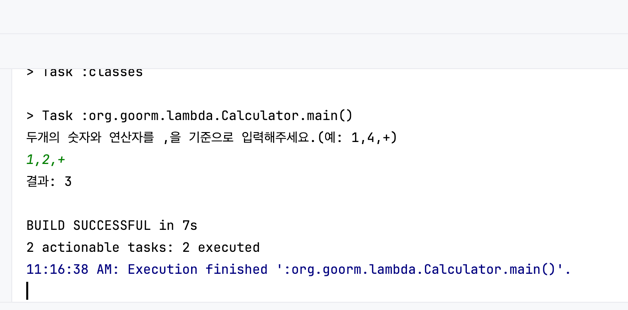
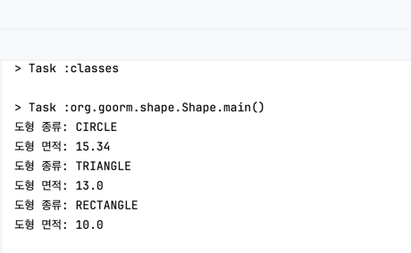
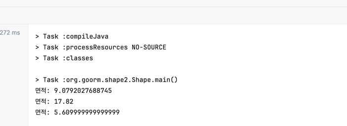
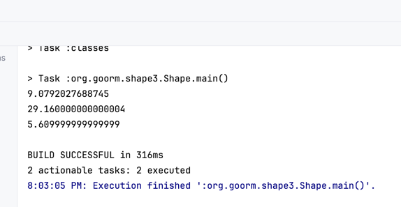
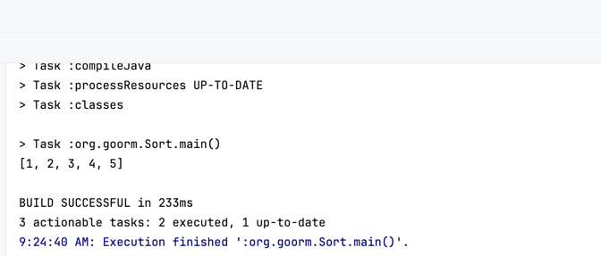
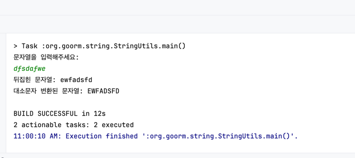
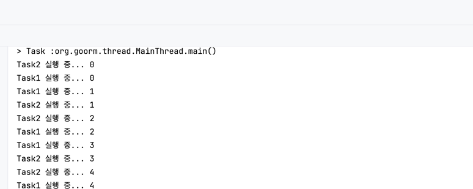

# 구름 미션 수행 레포
## 자바 중급

### 직사각형 클래스 작성하기

- [코드](src/main/java/org/goorm/Rectangle.java)

### 예외 처리가 포함된 계산기 프로그램 작성하기

- [코드](src/main/java/org/goorm/calculator/Calculator.java)

### 직원 클래스와 관리자 클래스 작성하기

- [코드](src/main/java/org/goorm/company/Company.java)

### 람다 표현식을 활용한 간단한 계산기 프로그램 작성하기

- [코드](src/main/java/org/goorm/lambda/Calculator.java)

### 도형 클래스와 도형 배열 다루기

- [코드](src/main/java/org/goorm/shape1/Shape.java)

### 도형 인터페이스 작성하기

- [코드](src/main/java/org/goorm/shape2/Shape.java)

### 추상 클래스와 인터페이스를 활용한 도형 프로그램 작성하기

- [코드](src/main/java/org/goorm/shape3/Shape.java)

### 배열을 사용하여 간단한 정렬 알고리즘 구현하기

- [코드](src/main/java/org/goorm/sort/SortMain.java)

### 문자열 뒤집기 및 대소문자 변환 프로그램 작성하기

- [코드](src/main/java/org/goorm/string/StringUtils.java)

### 두 개의 스레드를 생성하여 동시에 실행하기

- [코드](src/main/java/org/goorm/thread/MainThread.java)
